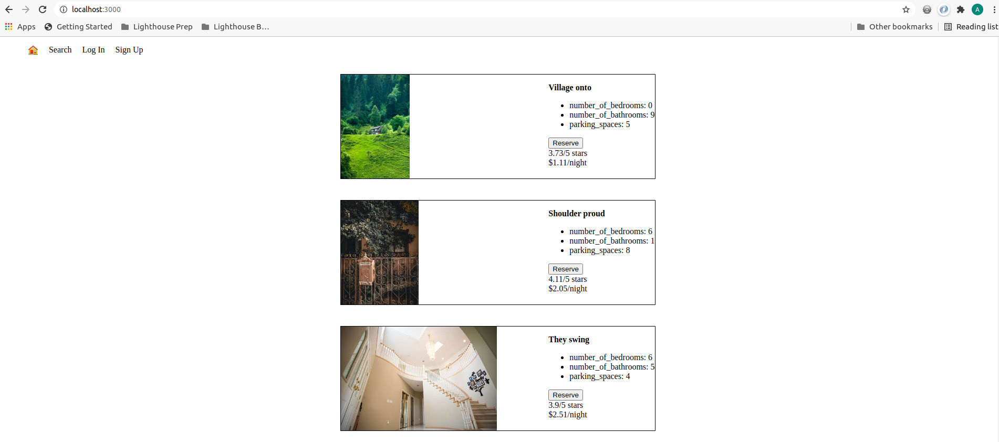
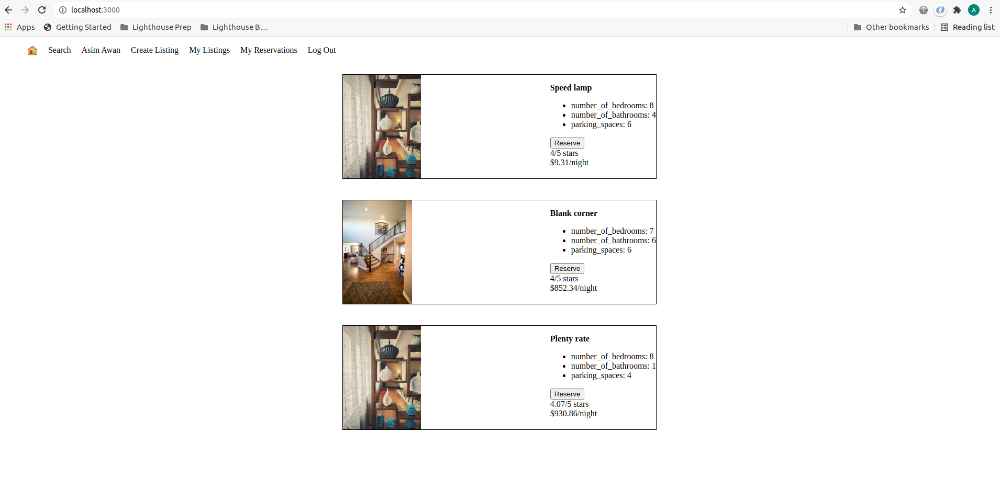

# LightBNB Project

LightBNB is a simple, single-page AirBNB clone.

## Project brief

LightBNB is a Single Page App (SPA) built using HTML, CSS, JS, jQuery and AJAX on the client-side and Node, Express on the server-side

## Features

- Listings get posted without the need to refresh page
- Logged in users can create and see their listings
- Logged in users can make reservations
- Page design is responsive

## Getting Started

1. Fork this repository, then clone your fork of this repository.
2. Install dependencies using the `npm install` command.
3. Start the web server using the `npm run local` command. The app will be served at <http://localhost:3000/>.
4. Go to <http://localhost:3000/> in your browser.

## Dependencies

- Express
- bcrypt
- Node 5.10.x or above
- Body-parser
- pg

## Dev Dependencies

- Nodemon

## Screenshots

